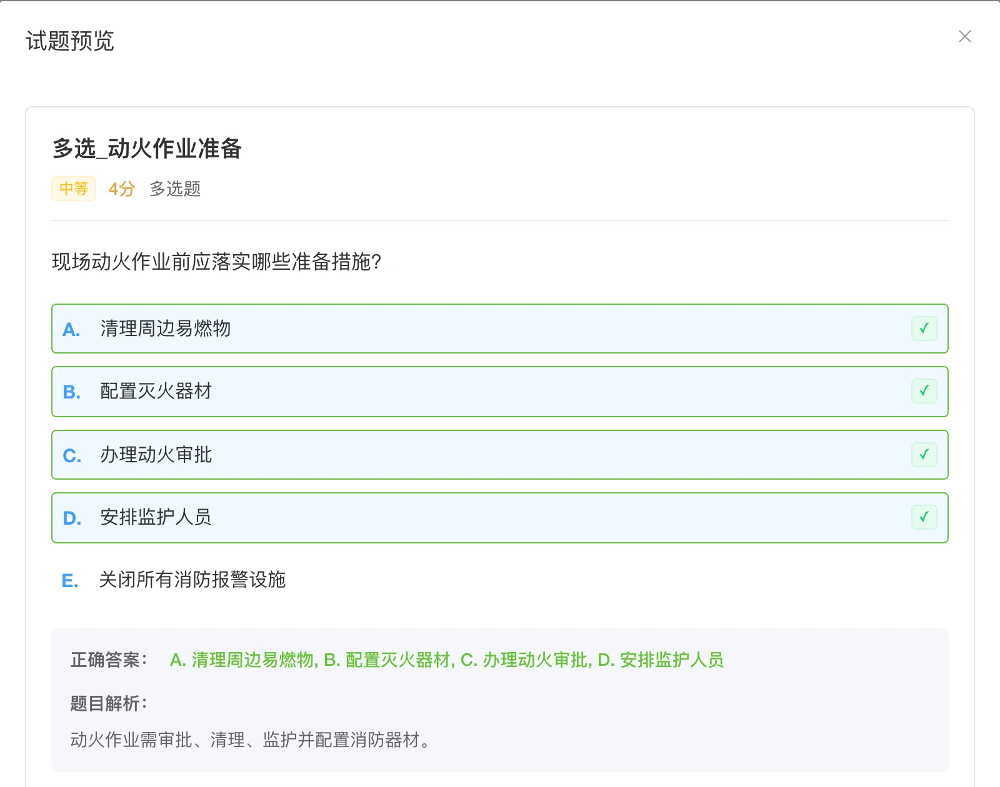

# 考试培训系统

[](LICENSE) [](https://vuejs.org/) [](https://www.java.com/)

基于 RuoYi 的在线考试与培训系统。从题库维护、固定或随机组卷，到在线作答、成绩查询和课程学习，在同一平台完成考试与培训管理。提供管理端、学员端页面和移动端接口。

[界面预览](#界面预览) · [在线体验](#在线体验) · [快速开始](#快速开始) · [文档](#文档) · [作者作品集](http://43.156.229.191:8080/portfolio/)

> 公开仓库提供通用业务源码，不包含真实题库、学员资料或生产数据库。当前未附完整数据库初始化脚本，本地部署前需准备专用测试库及基础权限数据。

## 功能

- **题库管理**：题目分类、题型、难度、分值、解析和批量维护。
- **组卷与考试**：固定/随机组卷、考试发布、作答、交卷、成绩和考试状态管理。
- **培训学习**：课程、课件、学习记录和学员侧入口。
- **管理平台**：用户、角色、菜单、字典、操作日志和定时任务。
- **移动端接口**：为 H5 或其他客户端提供登录、考试和成绩查询接口。

## 技术栈

| 层 | 技术 |
| --- | --- |
| 前端 | Vue 2、Vue CLI、Element UI、Axios |
| 后端 | Java、Spring Boot、Spring Security、MyBatis、JWT |
| 平台 | RuoYi、MySQL、Redis、Maven |

## 界面预览

### 试题预览与答案解析



图片来自已有演示环境，使用示例内容；当前部署版本的界面可能有所变化。 本图裁去了底部测试标签，仅保留试题预览区域。

## 在线体验

- [考试培训系统在线演示](http://43.156.229.191:9527/)
- 管理端与学员端按账号角色开放；访问需要登录。

体验入口与本地部署相互独立，请只使用演示题目和虚构学员数据。

## 快速开始

### 环境要求

Git、JDK 8、Maven、Node.js 16、npm、MySQL 和 Redis。仓库的 `.java-version` 与 `.nvmrc` 分别指定 Java 8 和 Node 16；前端 `engines` 要求 Node ≥14 且 <17。

### 1. 获取代码

```bash
git clone https://github.com/WuZhaohui1993/exam-ruoyi-public.git
cd exam-ruoyi-public
```

### 2. 准备本地配置

后端配置入口为 [application.yml](backend/ruoyi-admin/src/main/resources/application.yml)，数据库配置参考 [application-druid.example.yml](backend/ruoyi-admin/src/main/resources/application-druid.example.yml)。通过启动进程或 IDE 环境注入：

| 配置 | 用途 |
| --- | --- |
| `MYSQL_URL`、`MYSQL_USERNAME`、`MYSQL_PASSWORD` | 专用测试数据库连接 |
| `REDIS_HOST`、`REDIS_PORT` | 缓存连接 |
| `TOKEN_SECRET` | 登录令牌签名密钥 |
| `SERVER_PORT` | 后端端口，默认 8080 |

公开配置仅为连接示例，不能替代完整数据库、数据源配置及菜单初始化。准备好相应表结构、角色和测试账号后，再验证登录、组卷与作答链路。

### 3. 构建与启动

在仓库根目录执行：

```bash
mvn -f backend/pom.xml -DskipTests package
java -jar backend/ruoyi-admin/target/ruoyi-admin.jar
```

另开终端启动前端：

```bash
cd frontend
npm install
npm run dev -- --port 5173
```

上述命令指定前端开发端口为 5173；前端 API 代理默认连接 `http://127.0.0.1:8080`。后端更换端口时同步调整 [vue.config.js](frontend/vue.config.js)。

## 测试

安装依赖并准备好上述配置后，在仓库根目录执行：

```bash
mvn -f backend/pom.xml test
mvn -f backend/pom.xml -DskipTests package
npm --prefix frontend run build:prod
git diff --check
```

后端测试和启动依赖测试数据库、Redis 与权限数据。打包成功不代表登录、判卷或学习记录已验收；重点复测试卷规则、重复交卷、考试时间与不同角色的访问权限。 `-DskipTests package` 仅表示跳过测试打包，不表示测试通过。

## 文档

- [后端配置](backend/ruoyi-admin/src/main/resources/application.yml)
- [数据库配置参考](backend/ruoyi-admin/src/main/resources/application-druid.example.yml)
- [前端开发与代理](frontend/vue.config.js)
- [用户选择组件说明](frontend/src/components/UserSelect/README.md)
- [参与贡献](CONTRIBUTING.md)
- [安全说明](SECURITY.md)
- [第三方依赖与版权](THIRD_PARTY_NOTICES.md)

## 项目结构

```text
├── frontend/               # Vue 2 管理端、学员端页面
├── backend/
│   ├── ruoyi-admin/        # Web 启动入口与控制器
│   ├── ruoyi-exam/         # 考试与培训业务
│   └── ruoyi-*/            # RuoYi 公共、安全与系统模块
├── docs/assets/            # README 演示截图
└── scripts/                # 辅助脚本
```

## 作者与作品集

- [GitHub · WuZhaohui1993](https://github.com/WuZhaohui1993)
- [个人作品集](http://43.156.229.191:8080/portfolio/)
- [问题反馈与功能建议](https://github.com/WuZhaohui1993/exam-ruoyi-public/issues)

欢迎交流使用问题、反馈 Bug 或提出功能建议；项目合作可通过作品集中的联系方式沟通。

## 安全边界

题库答案、学员资料、考试记录和上传课件应按角色限制访问。数据库、Redis 与令牌密钥由部署环境提供；生产环境另需配置 HTTPS、文件存储、备份恢复和权限审计。 更多说明见 [SECURITY.md](SECURITY.md)。

## 参与贡献

请先阅读 [贡献指南](CONTRIBUTING.md)，保持接口、权限、配置和文档同步。反馈问题时附上复现步骤、期望结果和必要截图；提交 PR 时说明实际执行的检查及未覆盖范围，不提交真实业务数据、私有凭据或构建产物。

## 许可证

本项目自有代码采用 [MIT License](LICENSE)。第三方组件、上游代码及厂商 SDK 遵循各自许可证；版权与再分发说明见 [THIRD_PARTY_NOTICES.md](THIRD_PARTY_NOTICES.md)。
